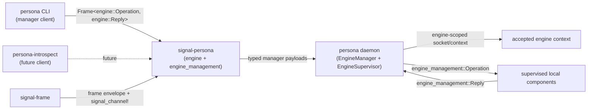

# signal-persona — Architecture

`signal-persona` is the typed Signal contract for clients talking to the
top-level `persona` engine manager and for the engine manager to talk to
its supervised local components.

This crate owns the manager payload records, two closed
request/reply channels (Engine and EngineManagement), frame
aliases, and round-trip tests. Contract records carry both rkyv
wire derives and NOTA text derives on the same types. Runtime
actors, storage, daemon startup, CLI parsing, terminal effects,
routing policy, and NOTA surface policy live outside this crate.

## Per-component-triad shape

This crate is one of the **two-channel triad exceptions**. The
canonical workspace triad is `<component>` + `signal-<component>` +
`owner-signal-<component>`; for persona the third leg is folded as a
**second channel inside this same crate**. There is no
`owner-signal-persona` repo. The engine-management channel
(`EngineManagement`) is the manager↔supervised-child authority
surface that an `owner-signal-<X>` would otherwise carry.

Persona-component version-upgrade authority (orders like "attempt
this handover", "force this flip", "roll back to that version",
"quarantine") is **not** in this contract — it lives in the
sibling `owner-signal-version-handover` contract that the
persona daemon consumes alongside this one. See
`/git/github.com/LiGoldragon/owner-signal-version-handover/ARCHITECTURE.md`.

## Migration history — contract-local verbs (2026-05-19)

This crate migrated from `signal-core` to `signal-frame` and from
universal `SignalVerb`-tagged variants to contract-local verbs per
`primary/reports/designer/241-signal-architecture-migration-guide.md`.

Engine channel operation roots: `Launch` / `Query` / `Retire` /
`Start` / `Stop`. The five former `*Query` variants
(`EngineCatalogQuery`, `EngineStatusQuery`, `ComponentStatusQuery`)
lifted into a single `Query` operation root whose payload is a
closed enum naming the read target.

EngineManagement channel operation roots: `Announce` / `Query` /
`Stop`. `ComponentHello` became `Announce(Presence)`. Readiness
and health queries unified into `Query` with a payload enum
`engine_management::Query::{ReadinessStatus, HealthStatus}`.
`GracefulStopRequest` became the contract-local `Stop(ComponentName)`
operation.

Type renames (drop redundant Engine* / Component* prefixes where the
crate domain implies them, and replace the universal "Supervision"
vocabulary with "EngineManagement"):

- `EngineLaunchProposal` → `EngineLaunch`
- `EngineLaunchAcceptance` → `LaunchAcceptance`
- `EngineLaunchRejection` → `LaunchRejection`
- `EngineLaunchRejectionReason` → `LaunchRejectionReason`
- `EngineRetirement` removed (Retire takes `EngineIdentifier` directly)
- `EngineRetirementAcceptance` removed (Retired carries `EngineIdentifier`)
- `EngineRetirementRejection` → `RetirementRejection`
- `EngineRetirementRejectionReason` → `RetirementRejectionReason`
- `EngineCatalogQuery` / `EngineStatusQuery` / `ComponentStatusQuery`
  removed (replaced by `Query` enum variants)
- `ComponentStatusMissing` removed (ComponentMissing reply variant
  carries `ComponentName`)
- `SupervisorActionAcceptance` → `ActionAcceptance`
- `SupervisorActionRejection` → `ActionRejection`
- `SupervisorActionRejectionReason` → `ActionRejectionReason`
- `ComponentHello` → `Presence`
- `ComponentReadinessQuery` / `ComponentHealthQuery` removed
- `GracefulStopRequest` removed (Stop takes `ComponentName` directly)
- `GracefulStopAcknowledgement` → `StopAcknowledgement`
- `SupervisionProtocolVersion` → `EngineManagementProtocolVersion`
- `SupervisionUnimplemented` → `EngineManagementUnimplemented`
- `SupervisionUnimplementedReason` → `EngineManagementUnimplementedReason`
- `pub mod supervision` → `pub mod engine_management`
- `SpawnEnvelope.supervision_socket_path` →
  `SpawnEnvelope.engine_management_socket_path`
- `SpawnEnvelope.supervision_socket_mode` →
  `SpawnEnvelope.engine_management_socket_mode`
- `*.supervision_protocol_version` → `*.engine_management_protocol_version`

Reply variant renames follow verb-form past-participle on the
outcome variants (`Launched`, `Retired`, `Identified`, `Ready`,
`HealthReport`, `StopAcknowledged`) and direct data-shape nouns on
the value variants (`Catalog`, `EngineStatus`, `ComponentStatus`).

Auto-generated by the `signal_channel!` macro: `Operation` (the
request enum, scoped per channel module), `OperationKind` (kind()
projection), `Reply`, `Frame`, `FrameBody`, `ReplyEnvelope`,
`RequestBuilder`. The hand-written `signal_verb()` and
`operation_kind()` impls are retired; the macro generates `kind()`
directly.

## Relation



The accepted socket/engine context supplies the engine identity and
ingress context. Request payloads in this crate do not carry caller
identity, authorization proof, connection class, sender, or timestamp.

## Current surface

The implemented contract is intentionally narrow. This crate
carries **two channels, each with its own closed root family
and its own `signal_channel!` invocation**: the manager↔CLI
engine-catalog channel and the manager↔supervised-component
engine-management channel. Per `~/primary/skills/contract-repo.md`
§"Contracts name a component's wire surface" — *"a multi-relation
contract crate (one component, multiple channels) has one root
family per channel, not one crate-wide enum"* — the two channels
stay sharply separated so the CLI-oriented surface cannot
accidentally grow child-lifecycle verbs and vice versa.

**Engine channel** (`pub mod engine`):

| Operation | Payload | Reply |
|---|---|---|
| `Launch` | `EngineLaunch` | `Launched(LaunchAcceptance)` or `LaunchRejected(LaunchRejection)` |
| `Query` | `Query::Catalog(EngineCatalogScope)` | `Catalog(EngineCatalog)` |
| `Query` | `Query::EngineStatus(EngineStatusScope)` | `EngineStatus(EngineStatus)` |
| `Query` | `Query::ComponentStatus(ComponentName)` | `ComponentStatus(ComponentStatus)` or `ComponentMissing(ComponentName)` |
| `Retire` | `signal_persona_origin::EngineIdentifier` | `Retired(EngineIdentifier)` or `RetireRejected(RetirementRejection)` |
| `Start` | `ComponentStartup` | `ActionAccepted(ActionAcceptance)` or `ActionRejected(ActionRejection)` |
| `Stop` | `ComponentShutdown` | `ActionAccepted(ActionAcceptance)` or `ActionRejected(ActionRejection)` |

The Engine channel carries an `observable {}` block. Operation
events are typed by `OperationReceived { operation: OperationKind }`;
effect events by `EffectEmitted { observation: SemaObservation }`.
Per the designer lean, this enables persona-introspect and other
observers to subscribe to the manager's working traffic.

**EngineManagement channel** (`pub mod engine_management`):

| Operation | Payload | Reply |
|---|---|---|
| `Announce` | `Presence` | `Identified(ComponentIdentity)` |
| `Query` | `engine_management::Query::ReadinessStatus(ComponentName)` | `Ready(ComponentReady)` or `NotReady(ComponentNotReady)` |
| `Query` | `engine_management::Query::HealthStatus(ComponentName)` | `HealthReport(ComponentHealthReport)` |
| `Stop` | `ComponentName` | `StopAcknowledged(StopAcknowledgement)` |
| *any* (unbuilt variant) | (any payload) | `Unimplemented(EngineManagementUnimplemented)` |

The EngineManagement channel **does not** become a generic
command bus — it carries lifecycle facts only; domain
operations stay on the relevant `signal-persona-*` domain
contracts.

The EngineManagement channel has **no** `observable {}` block by
design. This channel is internal infrastructure traffic between
the engine manager and its supervised children; the manager already
knows what it sent and received. Adding observability here would
double-record without informational gain.

**Skeleton honesty**: every supervised daemon decodes every variant
of `engine_management::Operation`. For variants whose behavior is
built, it replies with the success/failure reply. For variants
whose behavior is not yet built, it replies with
`engine_management::Reply::Unimplemented(EngineManagementUnimplemented {
reason: NotInPrototypeScope })` — a typed answer, not a panic. The
same convention applies across every `signal-persona-*` contract.

**`EngineManagementUnimplemented` is constrained**:
`EngineManagementUnimplemented` is **only** for future
engine-management-channel variants beyond the current three-op
surface. The three prototype variants — `Announce`, `Query`, `Stop`
— are **what makes a process a Persona component**. A daemon that
replies `Unimplemented` to any of those three fails the prototype
readiness witness.

**Skeleton honesty across the component-triad family**: the rule
above codifies the EngineManagement-channel side, but the same
discipline applies across every ordinary `signal-persona-<X>` and
every `owner-signal-persona-<X>` contract:

- **Ordinary contracts** (`signal-persona-router`, `signal-persona-
  mind`, `signal-persona-harness`, `signal-persona-message`,
  `signal-persona-system`, `signal-persona-terminal`,
  `signal-persona-introspect`, etc.): every supervised daemon
  decodes every variant of its ordinary contract's `Operation`
  surface. Variants whose behavior is built reply with the typed
  success/failure reply for that variant. Variants whose behavior
  is not yet built reply with a typed Unimplemented for that
  contract (e.g. `MessageRequestUnimplemented`, the
  contract-local mirror of the EngineManagement form). The reply
  is always a typed answer, never a panic, never a silent drop.
- **Owner contracts** (`owner-signal-persona-mind`,
  `owner-signal-persona-orchestrate`, `owner-signal-persona-
  router`, and the remaining owner-side contracts as they
  emerge): same rule. The daemon decodes every variant on the
  owner socket and answers the unbuilt variants with the
  contract-local Unimplemented typed reply. The owner side does
  not get a silent-skip exemption — owner-issued mutates are the
  authority-chain surface, and the issuer needs typed acknowledgement
  for either commit-success or commit-deferred-because-unbuilt.

The codification is universal: a process is honest when its public
surface answers every operation it can decode with a typed
reply — built behavior or typed Unimplemented. The rule maintains
the property that the issuer's authority chain (per
`skills/component-triad.md` §"Authority chain") rests on
acknowledgements that are decoding-complete on every variant the
deployed contract version supports.

`signal-frame` owns the frame envelope, exchange identifiers,
handshake, and the `signal_channel!` macro. The six Sema classes
(`Assert` / `Mutate` / `Retract` / `Match` / `Subscribe` /
`Validate`) live in `signal-sema` as *payloadless classification
labels* used for observation only — they do not appear at this
contract's public surface. Per `skills/component-triad.md` §"Verbs
come in three layers", contract operations (Layer 1) are
domain-named, the daemon owns its typed Component Commands
(Layer 2), and Sema classes (Layer 3) are projected for
observation. Atomicity is structural — multi-payload
`Request<Payload>` commits as one unit. This crate owns the manager
payloads under contract-local operation roots.

## Version-upgrade authority is a sibling contract

Component-version upgrade orchestration is **not** part of this
contract. The persona daemon consumes a separate triad for it:

- `signal-version-handover` — the working ordinary channel used
  during a smart handover between two versions of a component
  daemon (markers, readiness, completion, mirror, divergence,
  recovery).
- `owner-signal-version-handover` — the owner-authority channel
  the engine manager listens on for upgrade orders (attempt
  handover, force flip, rollback, quarantine).

The daemon-internal Kameo messages `PrepareUpgrade`,
`CompleteUpgrade`, and `DriveVersionHandover`
(`persona/src/manager.rs`) are how the engine manager *implements*
upgrade orchestration internally; they do **not** appear at this
crate's wire surface.

## Typed records

`ComponentName` is an instance identifier. It stays open because runtime
instances may be named `persona-router`, `persona-message`, sandbox-specific
names, or future supervised component instances.

`ComponentKind` is the closed component class vocabulary:

```text
Mind
Orchestrate
Router
Message
System
Harness
Terminal
Introspect
Spirit
```

The `Message` variant (renamed from the retired `MessageProxy`)
names the engine's supervised message-ingress component. The
"proxy" name retires from variant, socket, binary, and env-var
vocabulary; the supervised daemon binary is `persona-message-daemon`.
The `Spirit` variant names the per-engine intent substrate daemon.

`ComponentStatus` combines both:

```text
ComponentStatus
  | name:          ComponentName
  | kind:          ComponentKind
  | desired_state: ComponentDesiredState
  | health:        ComponentHealth
```

The rest of the current records are similarly closed and small:

```text
EngineLaunch
  | label: EngineLabel

Query                                 (engine channel)
  | Catalog(EngineCatalogScope)
  | EngineStatus(EngineStatusScope)
  | ComponentStatus(ComponentName)

engine_management::Query              (engine_management channel)
  | ReadinessStatus(ComponentName)
  | HealthStatus(ComponentName)

EngineCatalogScope
  | AllEngines

EngineStatusScope
  | WholeEngine

LaunchAcceptance
  | engine: EngineIdentifier
  | label:  EngineLabel

LaunchRejection
  | label:  EngineLabel
  | reason: LaunchRejectionReason

LaunchRejectionReason
  | EngineLabelAlreadyExists
  | EngineLimitReached
  | LaunchPlanRejected

EngineCatalog
  | engines: Vec<EngineCatalogEntry>

EngineCatalogEntry
  | engine: EngineIdentifier
  | label:  EngineLabel
  | phase:  EnginePhase

RetirementRejection
  | engine: EngineIdentifier
  | reason: RetirementRejectionReason

RetirementRejectionReason
  | EngineNotFound
  | EngineStillRunning
  | EngineHasLiveRoutes

EngineStatus
  | generation: EngineGeneration
  | phase:      EnginePhase
  | components: Vec<ComponentStatus>

ComponentDesiredState
  | Running
  | Stopped

ComponentHealth
  | Starting
  | Running
  | Degraded
  | Stopped
  | Failed

ComponentStartup
  | component: ComponentName

ComponentShutdown
  | component: ComponentName

ActionAcceptance
  | component:     ComponentName
  | desired_state: ComponentDesiredState

ActionRejection
  | component: ComponentName
  | reason:    ActionRejectionReason

ActionRejectionReason
  | ComponentNotManaged
  | ComponentAlreadyInDesiredState

Presence
  | expected_component:                 ComponentName
  | expected_kind:                      ComponentKind
  | engine_management_protocol_version: EngineManagementProtocolVersion

ComponentIdentity
  | name:                               ComponentName
  | kind:                               ComponentKind
  | engine_management_protocol_version: EngineManagementProtocolVersion
  | last_fatal_startup_error:           Option<ComponentStartupError>

ComponentReady
  | component_started_at: Option<TimestampNanos>

ComponentNotReady
  | reason: ComponentNotReadyReason

ComponentHealthReport
  | health: ComponentHealth

StopAcknowledgement
  | drain_completed_at: Option<TimestampNanos>

EngineManagementProtocolVersion
  | u16

TimestampNanos
  | u64

ComponentStartupError
  | SocketBindFailed
  | StoreOpenFailed
  | EnvelopeIncomplete

ComponentNotReadyReason
  | NotYetBound
  | AwaitingDependency
  | RecoveringFromCrash

EngineManagementUnimplementedReason
  | NotInPrototypeScope                  -- variant exists in contract; behavior not yet built
  | DependencyMissing(DependencyKind)    -- needs a peer component to be Ready first
  | ResourceUnavailable(ResourceKind)    -- runtime preconditions unmet

DependencyKind
  | PeerComponent

ResourceKind
  | ManagerSocket
  | SocketPath
  | StateDirectory
```

### Engine observable bodies

```text
OperationReceived
  | operation: OperationKind                       (engine channel kind projection)

EffectEmitted
  | observation: SemaObservation                   (from signal-sema)
```

### SpawnEnvelope

The engine manager mints a `SpawnEnvelope` for each
supervised child at spawn time; the child reads its envelope
at startup and binds the named socket at the named mode.

**Two distinct records** carry the spawn information; only the
`SpawnEnvelope` is on the wire:

- `signal-persona::SpawnEnvelope` (this crate, the typed wire form):
  child-readable subset only — engine_identifier, component_kind,
  component_name, owner_identity, state_dir, domain_socket_path,
  domain_socket_mode, engine_management_socket_path,
  engine_management_socket_mode, peer_sockets, manager_socket,
  engine_management_protocol_version.
- `persona::launch::ResolvedComponentLaunch` (manager-internal Rust
  type, not in this crate): adds executable path, argv,
  environment, working directory, process-group mode, restart policy,
  and embeds the `SpawnEnvelope` as a field. `DirectProcessLauncher`
  consumes `ResolvedComponentLaunch`, forks/execs, writes the
  embedded envelope to the per-component file. The child reads only
  the envelope — never the executable path, argv, or environment of
  its own launch.

```text
SpawnEnvelope
  | engine_identifier:                          EngineIdentifier
  | component_kind:                     ComponentKind
  | component_name:                     ComponentName               (from signal-persona-origin)
  | owner_identity:                     OwnerIdentity               (from signal-persona-origin)
  | state_dir:                          WirePath                    (absolute path; empty when stateless)
  | domain_socket_path:                 WirePath                    (the component's operational socket)
  | domain_socket_mode:                 SocketMode                  (0600 internal | 0660 for Message)
  | engine_management_socket_path:      WirePath                    (the manager-to-child engine-management socket)
  | engine_management_socket_mode:      SocketMode                  (0600 internal)
  | peer_sockets:                       Vec<PeerSocket>             (domain_socket_path + ComponentName per peer)
  | manager_socket:                     WirePath                    (the persona daemon's engine-management listener)
  | engine_management_protocol_version: EngineManagementProtocolVersion

PeerSocket
  | component_name:                ComponentName
  | domain_socket_path:            WirePath

SocketMode
  | u32                                                              (POSIX mode bits; expected 0o600 or 0o660)
```

Each Unix socket has one frame vocabulary. Domain sockets speak the
component's `signal-persona-*` operational contract; engine-management
sockets speak `signal-persona::engine_management::Operation` /
`engine_management::Reply`. The manager does not multiplex two rkyv
frame types on one socket.

The manager writes one envelope file per child at
`/var/run/persona/<engine-id>/<component>.envelope` (or
equivalent runtime-dir path). The child reads through this
crate's typed decoder at startup, binds its domain and
engine-management sockets, applies the modes, and proceeds. Per
ESSENCE §"Infrastructure mints identity, time, and sender" —
the child does not invent its socket paths or component name.

**State directory for stateless components**: the `state_dir` field
is always populated; stateless components (today:
`persona-message-daemon`, `persona-system` in skeleton mode) leave
the directory empty and **do not open a redb file until they own
durable state**. Manager prepares the directory at envelope-mint
time; child opens it only if it has state to persist.

**`SpawnEnvelope.component_name` naming note**: the field is typed
as `signal-persona-origin::ComponentName` (closed enum of supervised
local component principals), **not** the open `signal-persona::ComponentName`
instance newtype. The two crates currently share the type name; the
intended split is `signal-persona-origin::ComponentPrincipal` for the
closed enum of supervised principals and
`signal-persona::ComponentInstanceName` for the open instance
identifier. Until that rename lands, this field carries the
**closed enum** form.

## Retired vocabulary

Older reports and previous architecture drafts used these names:

- `ConnectionClass`
- `EngineRoute`
- `EngineCreate`
- `EngineList`
- `EngineStart`
- `EngineShutdown`
- `EngineOwnershipTransfer`
- `OwnerIdentity` (the field type still exists in
  `signal-persona-origin`; the deprecated direct-on-Request shape does not)
- `SupervisionRequest` / `SupervisionReply`
- `SupervisionFrame` / `SupervisionFrameBody`
- `SupervisionOperation` / `SupervisionOperationKind`
- `SupervisionProtocolVersion`
- `SupervisionUnimplemented` / `SupervisionUnimplementedReason`
- `GracefulStopRequest` / `GracefulStopAcknowledgement`
- `EngineLaunchProposal` / `EngineLaunchAcceptance` /
  `EngineLaunchRejection` / `EngineLaunchRejectionReason`
- `ComponentHello` / `ComponentReadinessQuery` / `ComponentHealthQuery`
- `EngineCatalogQuery` / `EngineStatusQuery` / `ComponentStatusQuery`
- `EngineRetirement` / `EngineRetirementAcceptance` /
  `EngineRetirementRejection` / `EngineRetirementRejectionReason`
- `SupervisorActionAcceptance` / `SupervisorActionRejection` /
  `SupervisorActionRejectionReason`
- `ComponentStatusMissing`
- `pub mod supervision`

They are not part of the current `signal-persona` contract under those
names. Do not implement them from stale reports.

If any retired concept returns, it must re-enter through a fresh design
report, new closed record types, and round-trip tests. It must not be
inferred from stale prose.

## Boundaries

This crate owns:

- `engine::Operation` and `engine::Reply`, declared with `signal_channel!`.
- `engine_management::Operation` and `engine_management::Reply`,
  declared with a separate `signal_channel!`.
- `engine::{Frame, FrameBody, RequestBuilder, ReplyEnvelope}` aliases
  over `signal-frame`.
- `engine_management::{Frame, FrameBody, RequestBuilder, ReplyEnvelope}`
  aliases over `signal-frame`.
- Manager engine-catalog, status, and component lifecycle payload records.
- Closed status, health, phase, and rejection enums.
- rkyv frame round-trip tests and NOTA text round-trip tests for both channels.

This crate does not own:

- The `persona` daemon or Kameo actors.
- redb/Sema state.
- Engine socket layout or filesystem permissions.
- Auth validation or credential proof.
- Router, terminal, harness, system, message, mind, orchestrate, or
  introspect component contracts.
- Command-line parsing or policy for where NOTA text is accepted or printed.
- Inter-engine route policy.
- Version-upgrade authority vocabulary (lives in
  `signal-version-handover` and `owner-signal-version-handover`).

## Constraints

| Constraint | Witness |
|---|---|
| Each named channel has its own `signal_channel!` declaration. | source review in `src/lib.rs` |
| Engine operations are contract-local verbs in verb form (Layer 1); Sema classification is projected by the daemon (Layer 3). | round-trip tests assert each variant's contract-local NOTA head. |
| Every engine request/reply variant round-trips through a length-prefixed frame. | `nix flake check .#test-engine-manager` |
| Every engine-management request/reply variant round-trips through a length-prefixed frame. | `nix flake check .#test-engine-manager` |
| `ComponentKind` has no `MessageProxy` variant. | `nix flake check .#test-no-message-proxy-kind` |
| EngineManagement requests carry no domain payload (no MessageBody, RoleClaim, TerminalInput). | `nix flake check .#test-engine-management-no-domain-payload` |
| `engine_management::Reply::Unimplemented(EngineManagementUnimplemented)` exists and round-trips. | `nix flake check .#test-engine-management-unimplemented-round-trip` |
| `SpawnEnvelope` is a closed typed record (no string-keyed extension). | source review + round-trip in `tests/spawn_envelope.rs` |
| Contract payload values round-trip through NOTA without schema mirrors. | `engine_status_contract_payload_round_trips_through_nota` |
| Requests carry no caller identity, class, proof, sender, timestamp, or minted engine id. | source review in `src/lib.rs` |
| Wire enums contain no `Unknown` variant. | source review in `src/lib.rs`: every closed enum (`EnginePhase`, `ComponentKind`, `ComponentDesiredState`, `ComponentHealth`, etc.) is exhaustively matched in `tests/engine_manager.rs`; adding an `Unknown` variant breaks the match. |
| Any record name containing the word `Unknown` represents a positive "entity not in our state" rejection, not a polling-shape escape hatch. | This crate has no such records today. |
| Each variant's NOTA head matches the contract-local verb declared in `signal_channel!`. | round-trip tests assert each variant's expected head for both channels. |
| Round-trip witnesses cover every variant in rkyv. | `tests/engine_manager.rs` covers every request and reply variant for both channels. |
| Round-trip witnesses cover every variant in NOTA. | `examples/canonical.nota` holds one canonical text example per request/reply variant for both channels; round-trip tests parse and re-emit each. |
| No stringly-typed dispatch (`match s.as_str()`) for closed-set states. | All phase / kind / health / readiness / reason fields are typed closed enums. |
| Contract crate dependencies use a named API reference (branch or tag), not a raw revision pin. | `Cargo.toml` review: `signal-frame` and downstream contract crates declare `git = "..."` with a named-branch shape; raw `rev = "..."` pins are not used. |
| Contract compatibility with `signal-frame` is explicit. | `nix flake check .#test-version` |
| Engine channel carries an `observable {}` block; EngineManagement channel intentionally does not. | source review in `src/lib.rs` (engine `observable` at the channel macro; engine_management channel macro has no `observable` block). |

## NOTA codec quirk on `signal_channel!` payload heads

The `signal_channel!` macro emits a request variant's NOTA head as
the **payload's record head**, not the Rust variant name. For
example, `engine::Operation::Launch(EngineLaunch { .. })`
encodes as `(EngineLaunch (...))` (the payload head happens
to match the variant name here); a future variant whose payload
type differs from the variant name encodes under the **payload**
head. Canonical examples and round-trip tests carry the payload
heads.

## Versioning pin discipline

This crate depends on `signal-frame` via a named-branch reference,
not a raw revision pin. The destination is a stable `signal-frame`
API branch/bookmark once that lane is declared; raw `rev = "..."`
pins are not used.

## Code map

```text
src/lib.rs                  payload records and both signal_channel! declarations
                            (engine + engine_management modules)
examples/canonical.nota     one canonical example per request/reply variant for both channels
tests/engine_manager.rs     frame and NOTA round trips for engine and engine-management records
tests/canonical_examples.rs canonical NOTA example parsing
tests/spawn_envelope.rs     SpawnEnvelope round trips
tests/version.rs            signal-frame version witness
```

## See also

- `/git/github.com/LiGoldragon/persona/ARCHITECTURE.md` — runtime engine
  manager that consumes this contract on both channels.
- `/git/github.com/LiGoldragon/signal-frame/ARCHITECTURE.md` — Signal frame
  kernel (envelope, exchange identifiers, handshake, macro).
- `/git/github.com/LiGoldragon/signal-sema/ARCHITECTURE.md` —
  payloadless Sema classification vocabulary used at the observation
  layer.
- `/git/github.com/LiGoldragon/signal-persona-origin/ARCHITECTURE.md` —
  provenance and ingress context vocabulary.
- `/git/github.com/LiGoldragon/signal-version-handover/ARCHITECTURE.md` —
  working contract for component version handover (consumed by the
  persona daemon alongside this crate).
- `/git/github.com/LiGoldragon/owner-signal-version-handover/ARCHITECTURE.md`
  — owner-authority contract for upgrade orders against the engine
  manager.
- `~/primary/skills/contract-repo.md` — contract repo discipline.
- `~/primary/skills/component-triad.md` §"Verbs come in three layers".
