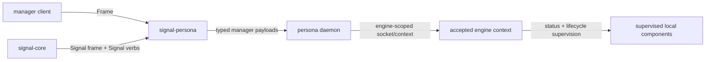

# signal-persona — Architecture

`signal-persona` is the typed Signal contract for clients talking to the
top-level `persona` engine manager.

This crate owns the manager payload records, closed request/reply enums, frame
aliases, and round-trip tests. Contract records carry both rkyv wire derives and
NOTA text derives on the same types. Runtime actors, storage, daemon startup,
CLI parsing, terminal effects, routing policy, and NOTA surface policy live
outside this crate.

## Migration history — contract-local verbs (2026-05-19)

This crate migrated from `signal-core` to `signal-frame` and from
universal `SignalVerb`-tagged variants to contract-local verbs per
`primary/reports/designer/241-signal-architecture-migration-guide.md`.

Engine relation operation roots: `Launch` / `Query` / `Retire` /
`Start` / `Stop`. The five former `*Query` variants
(`EngineCatalogQuery`, `EngineStatusQuery`, `ComponentStatusQuery`)
lifted into a single `Query` operation root whose payload is a
closed enum naming the read target.

Supervision relation operation roots: `Announce` / `Query` / `Stop`.
`ComponentHello` became `Announce(Presence)`. Readiness and health
queries unified into `Query` with a payload enum
`supervision::Query::{ReadinessStatus, HealthStatus}`.
`GracefulStopRequest` became the contract-local `Stop(ComponentName)`
operation — it stays here until `owner-signal-persona` is created.

Type renames (drop redundant Engine* / Component* / Supervisor*
prefixes where the crate domain implies them):

- `EngineLaunchProposal` → `EngineLaunch`
- `EngineLaunchAcceptance` → `LaunchAcceptance`
- `EngineLaunchRejection` → `LaunchRejection`
- `EngineLaunchRejectionReason` → `LaunchRejectionReason`
- `EngineRetirement` removed (Retire takes `EngineId` directly)
- `EngineRetirementAcceptance` removed (Retired carries `EngineId`)
- `EngineRetirementRejection` → `RetirementRejection`
- `EngineRetirementRejectionReason` → `RetirementRejectionReason`
- `EngineCatalogQuery` / `EngineStatusQuery` / `ComponentStatusQuery`
  removed (replaced by `Query` enum variants)
- `ComponentStatusMissing` removed (ComponentMissing reply variant
  carries `ComponentName`)
- `SupervisorActionAcceptance` → `ActionAcceptance`
- `SupervisorActionRejection` → `ActionRejection`
- `SupervisorActionRejectionReason` → `ActionRejectionReason`
- `ComponentHello` → `Presence`
- `ComponentReadinessQuery` / `ComponentHealthQuery` removed
- `GracefulStopRequest` removed (Stop takes `ComponentName` directly)

Reply variant renames follow verb-form past-participle on the
outcome variants (`Launched`, `Retired`, `Identified`, `Ready`,
`HealthReport`, `StopAcknowledged`) and direct data-shape nouns on
the value variants (`Catalog`, `EngineStatus`, `ComponentStatus`).

Auto-generated by the new `signal_channel!` macro: `EngineOperation`
(the request enum, derived from the channel name), `EngineOperationKind`
(kind() projection), `SupervisionOperation`, `SupervisionOperationKind`.
The hand-written `signal_verb()` and `operation_kind()` impls are
retired; the macro generates `kind()` directly.

## Relation



The accepted socket/engine context supplies the engine identity and ingress
context. Request payloads in this crate do not carry caller identity,
authorization proof, connection class, sender, or timestamp.

## Current Surface

The implemented channel is intentionally narrow. This crate
carries **two relations, each with its own closed root family
and its own `signal_channel!` invocation**: the manager↔CLI
engine-catalog relation (`EngineOperation` / `EngineReply`)
and the manager↔supervised-component supervision relation
(`SupervisionOperation` / `SupervisionReply`). Per
`~/primary/skills/contract-repo.md` §"Contracts name a
component's wire surface" — *"a multi-relation contract
crate (one component, multiple relations) has one root
family per relation, not one crate-wide enum"* — the two
relations stay sharply separated so CLI-oriented surface
cannot accidentally grow child-lifecycle verbs and vice
versa.

**Engine catalog / CLI surface:**

| Operation | Payload | Reply |
|---|---|---|
| `Launch` | `EngineLaunch` | `Launched(LaunchAcceptance)` or `LaunchRejected(LaunchRejection)` |
| `Query` | `Query::Catalog(EngineCatalogScope)` | `Catalog(EngineCatalog)` |
| `Query` | `Query::EngineStatus(EngineStatusScope)` | `EngineStatus(EngineStatus)` |
| `Query` | `Query::ComponentStatus(ComponentName)` | `ComponentStatus(ComponentStatus)` or `ComponentMissing(ComponentName)` |
| `Retire` | `signal_persona_auth::EngineId` | `Retired(EngineId)` or `RetireRejected(RetirementRejection)` |
| `Start` | `ComponentStartup` | `ActionAccepted(ActionAcceptance)` or `ActionRejected(ActionRejection)` |
| `Stop` | `ComponentShutdown` | `ActionAccepted(ActionAcceptance)` or `ActionRejected(ActionRejection)` |

**Supervision relation** (manager-to-supervised-component):

| Operation | Payload | Reply |
|---|---|---|
| `Announce` | `Presence` | `Identified(ComponentIdentity)` |
| `Query` | `supervision::Query::ReadinessStatus(ComponentName)` | `Ready(ComponentReady)` or `NotReady(ComponentNotReady)` |
| `Query` | `supervision::Query::HealthStatus(ComponentName)` | `HealthReport(ComponentHealthReport)` |
| `Stop` | `ComponentName` | `StopAcknowledged(GracefulStopAcknowledgement)` |
| *any* (unbuilt variant) | (any payload) | `Unimplemented(SupervisionUnimplemented)` |

The supervision relation **does not** become a generic
command bus - it carries lifecycle facts only; domain
operations stay on the relevant `signal-persona-*` domain
contracts.

**Skeleton honesty**: every supervised daemon decodes every variant
of `SupervisionOperation`. For variants whose behavior is built,
it replies with the success/failure reply. For variants
whose behavior is not yet built, it replies with
`SupervisionReply::Unimplemented(SupervisionUnimplemented {
reason: NotInPrototypeScope })` — a typed answer, not a panic. The
same convention applies across every `signal-persona-*` contract.

**Supervision `Unimplemented` is constrained**:
`SupervisionUnimplemented` is **only** for future
supervision-relation variants beyond the current three-op surface.
The three prototype variants — `Announce`, `Query`, `Stop` — are
**what makes a process a Persona component**. A daemon that replies
`Unimplemented` to any of those three fails the prototype readiness
witness.

`signal-frame` owns the frame envelope, exchange identifiers,
handshake, and the `signal_channel!` macro. The six Sema verbs
(`Assert` / `Mutate` / `Retract` / `Match` / `Subscribe` /
`Validate`) live in `signal-sema` as typed-table execution
vocabulary — they do not appear at this contract's public surface.
Atomicity is structural — multi-payload `Request<Payload>` commits
as one unit. This crate owns the manager payloads under contract-
local operation roots.

## Typed Records

`ComponentName` is an instance identifier. It stays open because runtime
instances may be named `persona-router`, `persona-message`, sandbox-specific
names, or future supervised component instances.

`ComponentKind` is the closed component class vocabulary:

```text
Mind
Orchestrate
Router
Message
System
Harness
Terminal
Introspect
```

The `Message` variant (renamed from the retired
`MessageProxy`) names the engine's supervised message-ingress
component. The "proxy" name retires from variant, socket,
binary, and env-var vocabulary; the supervised daemon binary
is `persona-message-daemon`.

`ComponentStatus` combines both:

```text
ComponentStatus
  | name:          ComponentName
  | kind:          ComponentKind
  | desired_state: ComponentDesiredState
  | health:        ComponentHealth
```

The rest of the current records are similarly closed and small:

```text
EngineLaunch
  | label: EngineLabel

Query
  | Catalog(EngineCatalogScope)
  | EngineStatus(EngineStatusScope)
  | ComponentStatus(ComponentName)

EngineCatalogScope
  | AllEngines

LaunchAcceptance
  | engine: EngineId
  | label: EngineLabel

LaunchRejection
  | label:  EngineLabel
  | reason: LaunchRejectionReason

EngineLaunchRejectionReason
  | EngineLabelAlreadyExists
  | EngineLimitReached
  | LaunchPlanRejected

EngineCatalog
  | engines: Vec<EngineCatalogEntry>

EngineCatalogEntry
  | engine: EngineId
  | label:  EngineLabel
  | phase:  EnginePhase

EngineRetirementAcceptance
  | engine: EngineId

EngineRetirementRejection
  | engine: EngineId
  | reason: EngineRetirementRejectionReason

EngineRetirementRejectionReason
  | EngineNotFound
  | EngineStillRunning
  | EngineHasLiveRoutes

EngineStatus
  | generation: EngineGeneration
  | phase:      EnginePhase
  | components: Vec<ComponentStatus>

ComponentDesiredState
  | Running
  | Stopped

ComponentHealth
  | Starting
  | Running
  | Degraded
  | Stopped
  | Failed

SupervisorActionRejectionReason
  | ComponentNotManaged
  | ComponentAlreadyInDesiredState

SupervisionProtocolVersion
  | u16

TimestampNanos
  | u64

ComponentStartupError
  | SocketBindFailed
  | StoreOpenFailed
  | EnvelopeIncomplete

ComponentNotReadyReason
  | NotYetBound
  | AwaitingDependency
  | RecoveringFromCrash

SupervisionUnimplementedReason
  | NotInPrototypeScope                  -- variant exists in contract; behavior not yet built
  | DependencyMissing(DependencyKind)    -- needs a peer component to be Ready first
  | ResourceUnavailable(ResourceKind)    -- runtime preconditions unmet
```

### SpawnEnvelope

The engine manager mints a `SpawnEnvelope` for each
supervised child at spawn time; the child reads its envelope
at startup and binds the named socket at the named mode.

**Two distinct records** carry the spawn information; only the
`SpawnEnvelope` is on the wire:

- `signal-persona::SpawnEnvelope` (this crate, the typed wire form):
  child-readable subset only — engine_id, component_kind,
  component_name, state_dir, domain_socket_path, domain_socket_mode,
  supervision_socket_path, supervision_socket_mode, peer_sockets,
  manager_socket, supervision_protocol_version.
- `persona::launch::ResolvedComponentLaunch` (manager-internal Rust
  type, not in this crate): adds executable path, argv,
  environment, working directory, process-group mode, restart policy,
  and embeds the `SpawnEnvelope` as a field. `DirectProcessLauncher`
  consumes `ResolvedComponentLaunch`, forks/execs, writes the
  embedded envelope to the per-component file. The child reads only
  the envelope — never the executable path, argv, or environment of
  its own launch.

```text
SpawnEnvelope
  | engine_id:                    EngineId
  | component_kind:                ComponentKind
  | component_name:                ComponentName               (from signal-persona-auth)
  | owner_identity:                OwnerIdentity               (from signal-persona-auth)
  | state_dir:                     WirePath                    (absolute path; empty when stateless)
  | domain_socket_path:            WirePath                    (the component's operational socket)
  | domain_socket_mode:            SocketMode                  (0600 internal | 0660 for Message)
  | supervision_socket_path:       WirePath                    (the manager-to-child supervision socket)
  | supervision_socket_mode:       SocketMode                  (0600 internal)
  | peer_sockets:                  Vec<PeerSocket>             (domain_socket_path + ComponentName per peer)
  | manager_socket:                WirePath                    (the persona daemon's supervision socket)
  | supervision_protocol_version:  SupervisionProtocolVersion

PeerSocket
  | component_name:                ComponentName
  | domain_socket_path:            WirePath

SocketMode
  | u32                                                        (POSIX mode bits; expected 0o600 or 0o660)
```

Each Unix socket has one frame vocabulary. Domain sockets speak the
component's `signal-persona-*` operational contract; supervision
sockets speak `signal-persona::SupervisionOperation` /
`SupervisionReply`. The manager does not multiplex two rkyv frame
types on one socket.

The manager writes one envelope file per child at
`/var/run/persona/<engine-id>/<component>.envelope` (or
equivalent runtime-dir path). The child reads through this
crate's typed decoder at startup, binds its domain and
supervision sockets, applies the modes, and proceeds. Per
ESSENCE §"Infrastructure mints identity, time, and sender" —
the child does not invent its socket paths or component name.

**State directory for stateless components**: the `state_dir` field
is always populated; stateless components (today:
`persona-message-daemon`, `persona-system` in skeleton mode) leave
the directory empty and **do not open a redb file until they own
durable state**. Manager prepares the directory at envelope-mint
time; child opens it only if it has state to persist.

**`SpawnEnvelope.component_name` naming note**: the field is typed
as `signal-persona-auth::ComponentName` (closed enum of supervised
local component principals), **not** the open `signal-persona::ComponentName`
instance newtype. The two crates currently share the type name; the
intended split is `signal-persona-auth::ComponentPrincipal` for the
closed enum of supervised principals and
`signal-persona::ComponentInstanceName` for the open instance
identifier. Until that rename lands, this field carries the
**closed enum** form.

## Retired Vocabulary

Older reports and previous architecture drafts used these names:

- `ConnectionClass`
- `EngineRoute`
- `EngineCreate`
- `EngineList`
- `EngineStart`
- `EngineShutdown`
- `EngineOwnershipTransfer`
- `OwnerIdentity`

They are not part of the current `signal-persona` contract under those names.
Do not implement them from stale reports. The current engine-catalog names are
`EngineLaunchProposal`, `EngineCatalogQuery`, and `EngineRetirement`; the
request payloads do not carry caller identity, sender, timestamp, connection
class, or an agent-minted engine id. Provenance and local boundary facts belong
to `signal-persona-auth` / ingress context; component-to-component routing
belongs to relation-specific `signal-persona-*` contracts and the runtime
components that consume them.

If any retired concept returns, it must re-enter through a fresh design report,
new closed record types, and round-trip tests. It must not be inferred from
stale prose.

## Boundaries

This crate owns:

- `EngineOperation` and `EngineReply`, declared with `signal_channel!`.
- `SupervisionOperation` and `SupervisionReply`, declared with a separate
  `signal_channel!`.
- `Frame` / `FrameBody` aliases over `signal-core`.
- `SupervisionFrame` / `SupervisionFrameBody` aliases over `signal-core`.
- Manager engine-catalog, status, and component lifecycle payload records.
- Closed status, health, phase, and rejection enums.
- rkyv frame round-trip tests and NOTA text round-trip tests for the manager
  contract.

This crate does not own:

- The `persona` daemon or Kameo actors.
- redb/Sema state.
- Engine socket layout or filesystem permissions.
- Auth validation or credential proof.
- Router, terminal, harness, system, message, or mind component contracts.
- Command-line parsing or policy for where NOTA text is accepted or printed.
- Inter-engine route policy.

## Constraints

| Constraint | Witness |
|---|---|
| Each named relation has its own `signal_channel!` declaration. | source review in `src/lib.rs` |
| Engine catalog creation/query/retirement are six-root Signal operations. | `engine_catalog_requests_round_trip_with_declared_signal_verbs` |
| Every engine request/reply variant round-trips through a length-prefixed frame. | `nix flake check .#test-engine-manager` |
| Every supervision request/reply variant round-trips through a length-prefixed frame. | `nix flake check .#test-engine-manager` |
| `ComponentKind` has no `MessageProxy` variant. | `nix flake check .#test-no-message-proxy-kind` |
| Supervision requests carry no domain payload (no MessageBody, RoleClaim, TerminalInput). | `nix flake check .#test-supervision-no-domain-payload` |
| `SupervisionReply::SupervisionUnimplemented` exists and round-trips. | `nix flake check .#test-supervision-unimplemented-round-trip` |
| `SpawnEnvelope` is a closed typed record (no string-keyed extension). | source review + round-trip in `tests/spawn_envelope.rs` |
| Contract payload values round-trip through NOTA without schema mirrors. | `engine_status_contract_payload_round_trips_through_nota` |
| Requests carry no caller identity, class, proof, sender, timestamp, or minted engine id. | source review in `src/lib.rs` |
| Wire enums contain no `Unknown` variant. | source review in `src/lib.rs`: every closed enum (`EnginePhase`, `ComponentKind`, `ComponentDesiredState`, `ComponentHealth`, etc.) is exhaustively matched in `tests/engine_manager.rs`; adding an `Unknown` variant breaks the match. |
| Any record name containing the word `Unknown` represents a positive "entity not in our state" rejection, not a polling-shape escape hatch. | This crate has no such records today. |
| Every `signal_channel!` request variant has a typed `signal_verb()` mapping. | `engine_catalog_requests_round_trip_with_declared_signal_verbs` and supervision-relation round-trip witness assert each variant's expected root. |
| Round-trip witnesses cover every variant in rkyv. | `tests/engine_manager.rs` covers every request and reply variant for both relations. |
| Round-trip witnesses cover every variant in NOTA. | `examples/canonical.nota` holds one canonical text example per request/reply variant for both relations; round-trip tests parse and re-emit each. |
| No stringly-typed dispatch (`match s.as_str()`) for closed-set states. | All phase / kind / health / readiness / reason fields are typed closed enums. |
| Contract crate dependencies use a named API reference (branch or tag), not a raw revision pin. | `Cargo.toml` review: `signal-core` and downstream contract crates declare `git = "..."` with a named-branch shape; raw `rev = "..."` pins are not used. |
| Contract compatibility with `signal-core` is explicit. | `nix flake check .#test-version` |

## NOTA codec quirk on `signal_channel!` payload heads

The `signal_channel!` macro emits a request variant's NOTA head as
the **payload's record head**, not the Rust variant name. For
example, `EngineOperation::Launch(EngineLaunch { .. })`
encodes as `(EngineLaunchProposal (...))` (the payload head happens
to match the variant name here); a future variant whose payload type
differs from the variant name encodes under the **payload** head.
Canonical examples and round-trip tests carry the payload heads.

## Versioning Pin Discipline

This crate depends on `signal-core` via a named-branch reference,
not a raw revision pin. The destination is a stable `signal-core`
API branch/bookmark once that lane is declared; raw `rev = "..."`
pins are not used.

## Code Map

```text
src/lib.rs              manager payload records and both signal_channel! declarations
examples/canonical.nota one canonical example per request/reply variant for both relations
tests/engine_manager.rs frame and NOTA round trips for engine catalog and supervision records
tests/spawn_envelope.rs SpawnEnvelope round trips
tests/version.rs        signal-core version witness
```

## See Also

- `/git/github.com/LiGoldragon/persona/ARCHITECTURE.md` — runtime manager
  that consumes this contract.
- `/git/github.com/LiGoldragon/signal-core/ARCHITECTURE.md` — Signal frame
  kernel and Signal verbs.
- `/git/github.com/LiGoldragon/signal-persona-auth/ARCHITECTURE.md` —
  provenance and ingress context vocabulary.
- `~/primary/skills/contract-repo.md` — contract repo discipline.
