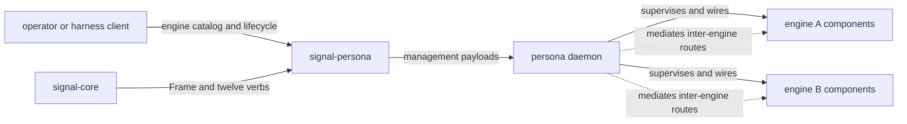

# signal-persona — architecture

*Management contract for the `persona` engine manager over Signal frames.*

`signal-persona` is the contract crate for talking to the top-level
`persona` engine manager. The manager is a host-level supervisor
daemon that runs as a privileged system user and manages **multiple
engine instances** on one host. It allocates per-engine sockets and
state directories, spawns and wires component daemons, classifies
every incoming connection by `ConnectionClass`, and mediates
inter-engine routes between personas.

This crate depends on `signal-core` for the frame envelope, handshake,
auth proof, typed slots, revisions, and the closed twelve-verb request
spine. This crate supplies the request, reply, record, query, and
projection payloads for the engine-manager relation.

> **Scope: today, not eventually.** The twelve-verb spine defined in
> `signal-core` is today's realization step toward eventual `Sema`
> (universal medium for meaning — see `~/primary/ESSENCE.md` §"Today
> and eventually"); today's contract surface is built rightly for the
> scope it serves now.

Relation sentence: clients speak `signal-persona` to the `persona`
engine manager; `signal-core` owns frame authority and the twelve
verbs, the `persona` runtime owns supervisor behavior and state, and
this crate owns only the management payload types that cross that
relation — engine catalog operations, component lifecycle operations,
connection classification, and inter-engine route declarations.

---

## 0 · TL;DR

This crate owns types and encoding only. It does not own the
supervisor daemon, actors, storage, Nexus records in NOTA syntax,
routing policy, terminal adapters, or deployment.



For the **why** behind multi-engine, the privileged-user position,
the `ConnectionClass` model, and the inter-engine route system, see
`~/primary/reports/designer/115-persona-engine-manager-architecture.md`.

---

## 1 · Wire Shape

The wire is `signal_core::Frame<EngineRequest, EngineReply>` encoded as
a length-prefixed rkyv archive. Top-level operation requests use
`signal_core::Request<EngineRequest>`:

```text
Request::Operation { verb: SemaVerb::Match,  payload: EngineRequest::EngineStatusQuery(...) }
Request::Operation { verb: SemaVerb::Match,  payload: EngineRequest::EngineList(()) }
Request::Operation { verb: SemaVerb::Mutate, payload: EngineRequest::EngineCreate(...) }
Request::Operation { verb: SemaVerb::Mutate, payload: EngineRequest::EngineRouteRequest(...) }
Request::Operation { verb: SemaVerb::Match,  payload: EngineRequest::ConnectionClassQuery(...) }
```

The verb set comes from `signal-core`:

```text
Assert Subscribe Constrain Mutate Match Infer
Retract Aggregate Project Atomic Validate Recurse
```

The engine-manager contract adds query and supervisor-action payloads
beneath those verbs. The verb set stays in `signal-core`.

---

## 2 · Engine Catalog Operations

| Variant | Verb | Payload | Reply |
|---|---|---|---|
| `EngineStatusQuery` | Match | `(EngineId or WholeEngine)` | `EngineStatus` or `ComponentStatusMissing` |
| `EngineList` | Match | `()` | `EngineList { engines: Vec<EngineSummary> }` |
| `EngineCreate` | Mutate | `(OwnerIdentity, ComponentSet, Option<EngineName>)` | `EngineCreated` or `EngineRejected` |
| `EngineStart` | Mutate | `(EngineId)` | `EngineStartAck` or `SupervisorActionRejected` |
| `EngineShutdown` | Mutate | `(EngineId, ShutdownMode)` | `EngineShutdownAck` or `SupervisorActionRejected` |
| `EngineOwnershipTransfer` | Mutate | `(EngineId, NewOwner)` | `OwnershipTransferred` or `OwnershipTransferRejected` |

---

## 3 · Component Lifecycle Operations

| Variant | Verb | Payload | Reply |
|---|---|---|---|
| `ComponentStatusQuery` | Match | `(EngineId, ComponentName)` | `ComponentStatus` or `ComponentStatusMissing` |
| `ComponentStartup` | Mutate | `(EngineId, ComponentName)` | `SupervisorActionAccepted` or `SupervisorActionRejected` |
| `ComponentShutdown` | Mutate | `(EngineId, ComponentName)` | `SupervisorActionAccepted` or `SupervisorActionRejected` |

---

## 4 · Inter-Engine Route Operations

| Variant | Verb | Payload | Reply |
|---|---|---|---|
| `EngineRouteRequest` | Mutate | `(FromEngine, ToEngine, Kinds)` | `RouteRequested` or `RouteRejected` |
| `EngineRouteApprove` | Mutate | `(RouteId)` | `RouteAdded` or `RouteApprovalRejected` |
| `EngineRouteReject` | Mutate | `(RouteId, Reason)` | `RouteRejected` |
| `EngineRouteRemove` | Mutate | `(RouteId)` | `RouteRemoved` |
| `EngineRouteList` | Match | `(Option<EngineId>)` | `RouteList { routes: Vec<EngineRoute> }` |

---

## 5 · Connection Class Operations

| Variant | Verb | Payload | Reply |
|---|---|---|---|
| `ConnectionClassQuery` | Match | `(ConnectionToken)` | `ConnectionClass { class }` |

`ConnectionClassQuery` is primarily a debug/audit surface; the
`persona` daemon mints `ConnectionClass` at the engine boundary
during connection acceptance, and downstream components consume the
class as a property of the connection's `AuthProof`. The explicit
query exists for introspection and architectural-truth tests.

---

## 6 · Typed Records

### 6.1 Identity records

```text
EngineId       newtype, content-addressable (blake3-derived)
RouteId        newtype, content-addressable
Uid            newtype, Unix UID
SystemPrincipal newtype, system identity name
HostId         newtype, identifies a host in cross-host routing (future)
EngineName     newtype, optional human-facing label (not identity)
```

### 6.2 Owner identity (closed enum)

```text
OwnerIdentity
  | User(Uid)                      -- a Unix UID on this host
  | System(SystemPrincipal)        -- a privileged system identity
  | Cross(EngineId)                -- another engine owns this one (rare)
```

### 6.3 Connection class (closed enum)

```text
ConnectionClass
  | Owner                                                -- caller matches engine.owner
  | NonOwnerUser(Uid)                                    -- a different Unix user
  | System(SystemPrincipal)                              -- a privileged system principal
  | OtherPersona { engine_id: EngineId, host: HostId }   -- another engine
```

The class is **infrastructure-minted at the engine boundary**. The
agent never supplies a class. Per `~/primary/ESSENCE.md`
§"Infrastructure mints identity, time, and sender".

### 6.4 Engine and route records

```text
EngineSummary
  | id:         EngineId
  | name:       Option<EngineName>
  | owner:      OwnerIdentity
  | state:      EngineState         -- closed enum
  | generation: EngineGeneration    -- typed newtype
  | created:    EngineCreatedEvent  -- typed timestamp record

EngineState (closed enum)
  | Running
  | Paused
  | Stopped
  | Failed { reason: EngineFailureReason }

ComponentName (closed enum)
  | Mind
  | Router
  | System
  | Harness
  | Terminal
  | MessageProxy

DesiredState (closed enum)
  | Running
  | Paused
  | Stopped

ComponentSet
  | Default
  | Custom { components: Vec<ComponentName> }

ComponentStatus
  | engine_id:    EngineId
  | component:    ComponentName
  | desired:      DesiredState
  | actual:       DesiredState
  | generation:   ComponentGeneration
  | health:       ComponentHealth     -- typed enum

EngineRoute
  | route_id:       RouteId
  | from:           EngineId
  | to:             EngineId
  | kinds:          Vec<MessageKind>     -- re-exported from per-channel contracts
  | approval_state: ApprovalState
  | created:        EngineRouteCreated  -- typed timestamp record

ApprovalState (closed enum)
  | PendingFrom { engine_id: EngineId }   -- awaiting that engine's owner
  | OwnerApproved { approver: OwnerIdentity }
  | SystemApproved { rule: SystemApprovalRule }
  | Rejected { reason: RouteRejectionReason }

ShutdownMode (closed enum)
  | Graceful
  | Immediate

MessageKind  -- closed enum; opens via signal-persona-message and siblings re-exporting
```

### 6.5 Failure reasons

Every rejection variant carries a typed reason. No string-tagged
errors.

```text
EngineRejectionReason (closed enum)
  | DuplicateName
  | InsufficientPrivilege
  | OwnerMismatch
  | InvalidComponentSet
  | ResourceExhausted
  | SchemaMismatch

RouteRejectionReason (closed enum)
  | EngineNotFound { engine_id: EngineId }
  | OwnerDenied
  | RouteAlreadyExists { route_id: RouteId }
  | UnsupportedKind { kind: MessageKind }

SupervisorActionRejectionReason (closed enum)
  | UnknownEngine
  | UnknownComponent
  | AlreadyRunning
  | AlreadyStopped
  | DependencyNotRunning { needs: ComponentName }
```

---

## 7 · Record Discipline

Infrastructure mints identity, caller, classification, and transition
time. The agent never supplies them in request payloads.

| Value | Owner | In a request payload? |
|---|---|---|
| `EngineId` (new engine) | persona daemon, on accept of `EngineCreate` | no — only in replies and subsequent queries |
| `RouteId` | persona daemon, on `EngineRouteRequest` accept | no |
| Caller identity / `ConnectionClass` | engine-boundary minting from `AuthProof` | no — never |
| Transition timestamps | manager transition log | no |
| `EngineGeneration` / `ComponentGeneration` | persona runtime | yes (in replies and queries; never agent-supplied) |
| Engine owner | request payload to `EngineCreate` (gated by caller class) | yes |
| `ComponentName`, `DesiredState`, `ShutdownMode` | request payload | yes |

Concrete example: `EngineCreate` names the intended owner and the
component set. It does not carry the `EngineId` (the manager mints
it), the caller's class (the engine boundary mints it), or a
timestamp (the transition log stamps it). The reply is either
`EngineCreated { engine_id, owner }` or
`EngineRejected { reason: EngineRejectionReason }`.

---

## 8 · Owned Modules

```text
src/lib.rs                  manager payloads, signal_channel! invocation
src/identity.rs             EngineId, OwnerIdentity, ConnectionClass, ids
src/catalog.rs              EngineSummary, EngineState, ComponentSet, etc.
src/routes.rs               EngineRoute, ApprovalState, RouteId
src/reasons.rs              typed rejection reasons (closed enums)
tests/engine_catalog.rs     engine create/list/start/shutdown round trips
tests/component_lifecycle.rs  component start/stop/status round trips
tests/routes.rs             route request/approve/list round trips
tests/connection_class.rs   ConnectionClass round trips, every variant
tests/version.rs            signal-core version compatibility witness
```

Reply names stay relation-specific. Missing components are reported
as `ComponentStatusMissing` on query paths.

---

## 9 · Boundaries

This crate owns:

- Engine catalog, component lifecycle, route, and classification
  request/reply payload types.
- `EngineRequest` and `EngineReply`, declared through
  `signal_channel!`.
- `Frame` / `FrameBody` type aliases over `signal-core`.
- `ConnectionClass` and `OwnerIdentity` (today; candidates for
  migration to `signal-core` once a second contract domain needs
  them — per `~/primary/skills/contract-repo.md` §"Kernel
  extraction trigger").
- rkyv round-trip tests for the contract shape, covering every
  variant of every closed enum.

This crate does not own:

- Supervisor runtime actors, reducers, subscriptions, or redb tables.
- Per-engine state directory layout (system-specialist policy).
- Component-to-component contracts (those live in their
  relation-specific `signal-persona-*` crates).
- Terminal, window-manager, network, or harness effects.
- Nexus record parsing and rendering over NOTA syntax.
- CLI argv parsing.
- Auth validation behavior (the verifier; this crate carries only
  the `ConnectionClass` shape it produces).
- Linux capability sets the `persona` user requires
  (system-specialist policy).

---

## 10 · Invariants

- Engine-manager contract types are defined once, here.
- Component-to-component contracts live in their relation-specific
  `signal-persona-*` crates.
- Every manager client uses the same rkyv feature set through this
  crate and `signal-core`.
- Closed enums do not use an `Unknown` escape variant. Every
  rejection has a typed reason.
- Query records are payloads under verbs; they are not top-level
  verbs.
- Tests use typed records and frame round trips, not string-prefix
  checks.
- No manager schema field stores an agent-minted identity, sender,
  classification, or commit timestamp.
- `ConnectionClass` is infrastructure-supplied at the engine
  boundary; it is never in a request payload (only in
  `ConnectionClassQuery` replies, and as a property of the
  `AuthProof` riding alongside the frame).
- `EngineId` and `RouteId` are content-addressable and are minted by
  the persona daemon, never by the calling agent.

---

## 11 · Constraints (architectural-truth test seeds)

Per `~/primary/skills/architectural-truth-tests.md`, the load-bearing
constraints below should each have a named witness test in
`tests/`:

| Constraint | Test name |
|---|---|
| Every `EngineRequest` variant round-trips through rkyv | `engine_request_<variant>_round_trips` |
| Every `EngineReply` variant round-trips through rkyv | `engine_reply_<variant>_round_trips` |
| `ConnectionClass` round-trips every variant including `OtherPersona` | `connection_class_round_trips_every_variant` |
| `OwnerIdentity` round-trips every variant | `owner_identity_round_trips_every_variant` |
| `EngineRoute` round-trips with all `ApprovalState` variants | `engine_route_round_trips_with_every_approval_state` |
| Rejection reasons are closed enums, no `Unknown` variant | `rejection_reasons_have_no_unknown_variant` |
| Request payloads carry no caller identity, no timestamp, no class | `request_payloads_carry_no_infrastructure_minted_values` |
| `signal-core` version compatibility witness | `version_compatible_with_signal_core` |

---

## See Also

- `~/primary/reports/designer/115-persona-engine-manager-architecture.md`
  — the full architectural framing for the persona engine manager;
  this contract's substance derives from §10 of that report.
- `~/primary/reports/designer/114-persona-vision-as-of-2026-05-11.md`
  — the panoramic vision; this contract sits at the engine-manager
  seam.
- `~/primary/reports/designer/40-twelve-verbs-in-persona.md` — the
  twelve-verb spine this contract pairs payloads with.
- `~/primary/reports/operator/41-persona-twelve-verbs-implementation-consequences.md`
- `~/primary/skills/contract-repo.md` — wire-contract discipline
  (relation sentence, closed enums, examples-first round-trip).
- `~/primary/skills/rust-discipline.md` — Rust enforcement.
- `~/primary/ESSENCE.md` §"Infrastructure mints identity, time, and
  sender" — the principle `ConnectionClass` and `EngineId` follow.
- `../signal-core/ARCHITECTURE.md` — the wire kernel this crate
  layers atop.
- `../persona/ARCHITECTURE.md` — the engine manager runtime that
  consumes this contract. Pending absorption of designer/115.
