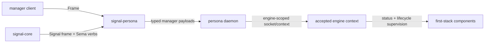

# signal-persona — Architecture

`signal-persona` is the typed Signal contract for clients talking to the
top-level `persona` engine manager.

This crate owns the manager payload records, closed request/reply enums, frame
aliases, and round-trip tests. Contract records carry both rkyv wire derives and
NOTA text derives on the same types. Runtime actors, storage, daemon startup,
CLI parsing, terminal effects, routing policy, and NOTA surface policy live
outside this crate.

## Relation



The accepted socket/engine context supplies the engine identity and ingress
context. Request payloads in this crate do not carry caller identity,
authorization proof, connection class, sender, or timestamp.

## Current Surface

The implemented channel is intentionally narrow. This crate
carries **two relations, each with its own closed root family
and its own `signal_channel!` invocation**: the manager↔CLI
engine-catalog relation (`EngineRequest` / `EngineReply`)
and the manager↔supervised-component supervision relation
(`SupervisionRequest` / `SupervisionReply`). Per
`~/primary/skills/contract-repo.md` §"Contracts name a
component's wire surface" — *"a multi-relation contract
crate (one component, multiple relations) has one root
family per relation, not one crate-wide enum"* — the two
relations stay sharply separated so CLI-oriented surface
cannot accidentally grow child-lifecycle verbs and vice
versa.

**Engine catalog / CLI surface:**

| Request | Sema verb | Reply |
|---|---|---|
| `EngineStatusQuery` | `Match` | `EngineStatus` |
| `ComponentStatusQuery` | `Match` | `ComponentStatus` or `ComponentStatusMissing` |
| `ComponentStartup` | `Mutate` | `SupervisorActionAccepted` or `SupervisorActionRejected` |
| `ComponentShutdown` | `Mutate` | `SupervisorActionAccepted` or `SupervisorActionRejected` |

**Supervision relation** (manager-to-supervised-component;
shape per `~/primary/reports/designer/142-supervision-in-signal-persona-no-message-proxy-daemon.md` §2.2):

| Request | Sema verb | Reply |
|---|---|---|
| `ComponentHello` | `Match` | `ComponentIdentity` (name, kind, supervision protocol version, last startup error) |
| `ComponentReadinessQuery` | `Match` | `ComponentReady { since }` or `ComponentNotReady { reason }` |
| `ComponentHealthQuery` | `Match` | `ComponentHealth` |
| `GracefulStopRequest` | `Mutate` | `GracefulStopAck { drain_completed_at }` |

Implementation lands per operator bead per /142 §8. The
supervision relation **does not** become a generic command
bus — it carries lifecycle facts only; domain operations
stay on the relevant `signal-persona-*` domain contracts.

`signal-core` owns the frame envelope and the twelve Sema verbs. This crate
owns the manager payloads under those verbs.

## Typed Records

`ComponentName` is an instance identifier. It stays open because runtime
instances may be named `persona-router`, `persona-message`, sandbox-specific
names, or future supervised component instances.

`ComponentKind` is the closed component class vocabulary:

```text
Mind
Router
Message
System
Harness
Terminal
```

The `Message` variant (renamed from the retired
`MessageProxy`) names the engine's supervised message-ingress
component. The "proxy" name retires from variant, socket,
binary, and env-var vocabulary; the supervised daemon binary
is `persona-message-daemon`. Per
`~/primary/reports/designer/142-supervision-in-signal-persona-no-message-proxy-daemon.md` §3.

`ComponentStatus` combines both:

```text
ComponentStatus
  | name:          ComponentName
  | kind:          ComponentKind
  | desired_state: ComponentDesiredState
  | health:        ComponentHealth
```

The rest of the current records are similarly closed and small:

```text
EngineStatus
  | generation: EngineGeneration
  | phase:      EnginePhase
  | components: Vec<ComponentStatus>

ComponentDesiredState
  | Running
  | Stopped

ComponentHealth
  | Starting
  | Running
  | Degraded
  | Stopped
  | Failed

SupervisorActionRejectionReason
  | ComponentNotManaged
  | ComponentAlreadyInDesiredState
```

## Retired Vocabulary

Older reports and previous architecture drafts used these names:

- `ConnectionClass`
- `EngineRoute`
- `EngineCreate`
- `EngineList`
- `EngineStart`
- `EngineShutdown`
- `EngineOwnershipTransfer`
- `OwnerIdentity`

They are not part of the current `signal-persona` contract. Do not implement
them from this crate's architecture. Provenance and local boundary facts belong
to `signal-persona-auth` / ingress context; component-to-component routing
belongs to relation-specific `signal-persona-*` contracts and the runtime
components that consume them.

If any retired concept returns, it must re-enter through a fresh design report,
new closed record types, and round-trip tests. It must not be inferred from
stale prose.

## Boundaries

This crate owns:

- `EngineRequest` and `EngineReply`, declared with `signal_channel!`.
- `Frame` / `FrameBody` aliases over `signal-core`.
- Manager status and component lifecycle payload records.
- Closed status, health, phase, and rejection enums.
- rkyv frame round-trip tests and NOTA text round-trip tests for the manager
  contract.

This crate does not own:

- The `persona` daemon or Kameo actors.
- redb/Sema state.
- Engine socket layout or filesystem permissions.
- Auth validation or credential proof.
- Router, terminal, harness, system, message, or mind component contracts.
- Command-line parsing or policy for where NOTA text is accepted or printed.
- Inter-engine route policy.

## Constraints

| Constraint | Witness |
|---|---|
| The channel has one `signal_channel!` declaration | source review in `src/lib.rs` |
| Every request variant round-trips through a length-prefixed frame | `nix flake check .#test-engine-manager` |
| Every reply variant round-trips through a length-prefixed frame | `nix flake check .#test-engine-manager` |
| Supervision requests carry no domain payload (no MessageBody, RoleClaim, TerminalInput) | `signal-persona/tests/supervision_no_domain_payload.rs` (planned per /142 §2.3) |
| Contract payload values round-trip through NOTA without schema mirrors | `engine_status_contract_payload_round_trips_through_nota` |
| Requests carry no caller identity, class, proof, sender, timestamp, or minted engine id | source review in `src/lib.rs` |
| Closed enums have no `Unknown` escape variant | source review in `src/lib.rs` |
| Contract compatibility with `signal-core` is explicit | `nix flake check .#test-version` |

## Code Map

```text
src/lib.rs              manager payload records and signal_channel! declaration
tests/engine_manager.rs frame and NOTA round trips for requests, replies, and component kinds
tests/version.rs        signal-core version witness
```

## See Also

- `/git/github.com/LiGoldragon/persona/ARCHITECTURE.md` — runtime manager
  that consumes this contract.
- `/git/github.com/LiGoldragon/signal-core/ARCHITECTURE.md` — Signal frame
  kernel and Sema verbs.
- `/git/github.com/LiGoldragon/signal-persona-auth/ARCHITECTURE.md` —
  provenance and ingress context vocabulary.
- `~/primary/skills/contract-repo.md` — contract repo discipline.
